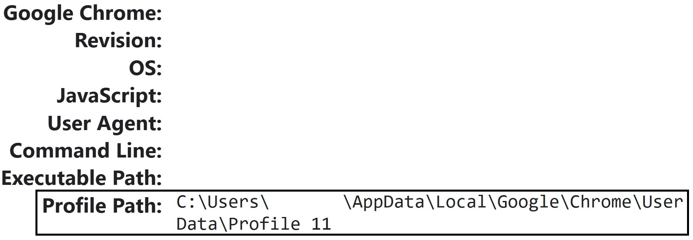

# Open multiple chrome profiles from a Powershell script
The description of a PowerShell script that opens multiple chrome profiles

# Google Chrome Profiles
In Google Chrome, each profile you create has a local directory named `Profile x`; where `x` is incremented for every new profile. <br>
Thus, there's no mapping between a profile's name (visible in the Crhome UI) and its directory. <br>
In order to know the path of a profile's directory on the local drive, open the profile and go to <a>chrome://version</a>, and look for a <b>Profile Path</b>. See the picture below.



# The Script itself
### Variables
I defined a variable, `$CHROME_EXE`, that contains the full path to the Chrome executable:
```Powershell
$CHROME_EXE = "C:\Program Files\Google\Chrome\Application\chrome.exe"
```
I need the full path the executable since it wans't added to the <i>Path</i> environment variable on my device.

For each of the profiles I want to open, I added their identifier , `x`, into a list called `profileIDs`:
```Powershell
$profileIDs = (11, 13) + (16..29)
```

### Loop
I iterated through the list opening each profile, with the directory `Profile x`, to <a>google.com</a> using the following for loop:
```Powershell
foreach ($i in $profileIDs) {
    & $CHROME_EXE "google.com" --profile-directory="Profile $i"
}
```

### The range operator
In the script I used the range operator `..` to define consecutive numbers:
```Powershell
(16..29)
```
This is equivalent to
```Powershell
$profileIDs = (11, 13, 16, 17, 18, 19, 20, 21, 22, 23, 24, 25, 26, 27, 28, 29)
```
And combined them to the rest of the list using the `+` operator:
```Powershell
$profileIDs = (11, 13) + (16..29)
```

## Executing a Powershell command defined in a variable
In the script, the full path to the chrome executable is contained in a variable called `$CHROME_EXE`. <br>
In order to treat the variable as a command, you must use the `&` operator:
```Powershell
& $CHROME_EXE
```
